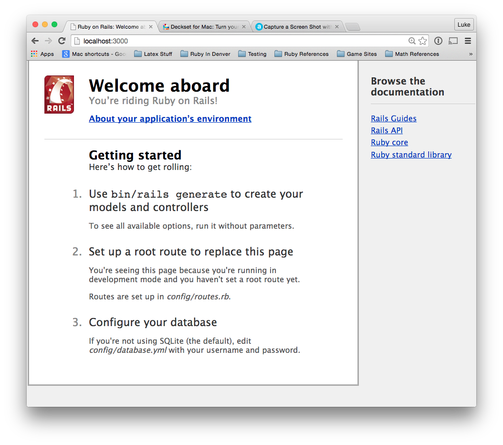
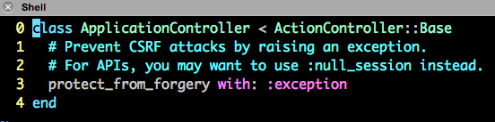
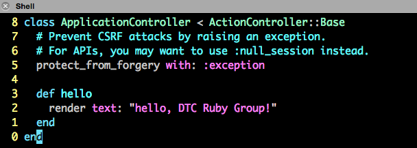
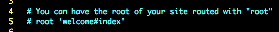
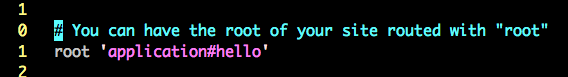
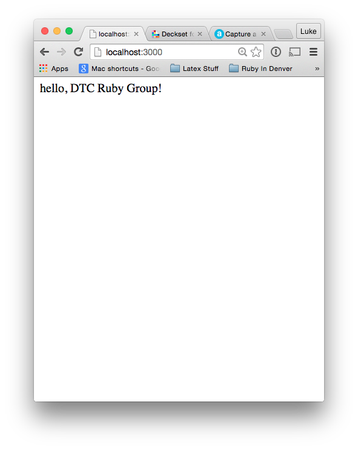
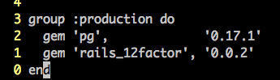
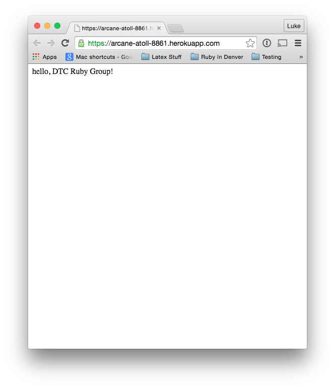

# Deploying a Web Site

### Luke DeWitt - DTC Ruby Meetup - 2/4/2015 - Ruby Beginners Talk

#### E-Mail - luke@dewittsoft.com / Twitter - lanewalkerx

---

# Overview of the steps in this talk

- Installing Rails
- Getting Rails up and running

---

# Installing Rails

```$ gem install rails -v 4.2.0```

- The -v flag ensures that it is rails version 4.2.0

- Note: This can take a while.

---

## First step "hello, DTC Ruby Group."

- First create this on my local machine.

- In a folder called workspace create a new rails application.

```
$ mkdir workspace     # Make a workspace directory.
$ cd workspace/       # Change into the workspace directory.
$ rails _4.2.0_ new hello_app
```

---

## First step "hello, DTC Ruby Group."

- The ```rails new``` command runs the bundle install command

- This command creates a new folder called ```hello_app```

- Then fills the new folder with all the boilplate code for a rails application

---

## First step "hello, DTC Ruby Group."

```
Lukes-MacBook-Pro:workspace luke$ cd hello_app/
Lukes-MacBook-Pro:hello_app luke$ ls
Gemfile   Rakefile  config    lib   test
Gemfile.lock  app   config.ru log   tmp
README.rdoc bin   db    public    vendor
```

---

## First step "hello, DTC Ruby Group."

There is now enough code to spin up a rails server.  All you have to do is invoke the following unix incantation.

```$ rails server```

Point your favorite browser to the following address.

### http://localhost:3000/

---

### First step "hello, DTC Ruby Group."

- The default home page is shown here.

- Notice this comes with links to rails online documentation.

- It also gives some hints on how to get started.



---

## First step "hello, DTC Ruby Group."

- Our first change will be to change the home page to say hello.

- Change to the controllers file under the apps file

```
$ cd app/controllers/
$ pwd
.../workspace/hello_app/app/controllers
$ ls
application_controller.rb concerns
```

---

## First step "hello, DTC Ruby Group."

- To do this have to change a couple of things.

- First is in the applicationcontroller.rb

```$ vi applicationcontroller.rb```



---

## First step "hello, DTC Ruby Group."

- Add the following to the file.



- This does not work quite yet need one more change.

---

## First step "hello, DTC Ruby Group."

- Have to tell the application where the root action is.

- Must change the root in the routes.rb file under the config folder.

```
$ cd config
$ ls
application.rb  database.yml  environments  locales   secrets.yml
boot.rb   environment.rb  initializers  routes.rb
$ pwd
.../workspace/hello_app/config
```

- Open up the routes.rb file

---

## First step "hello, DTC Ruby Group."

```$ vi routes.rb```



- Change the above to what is below



---

## First step "hello, DTC Ruby Group."

- This tells ruby to run the hello function in the application controller.

- Shut down your rails server if it is still running (Ctrl-c), and restart it.

- Again with your favorite browswer.

### http://localhost:3000/



---

## First step "hello, DTC Ruby Group."

The tutorial here goes through setting up a git repository.

It then pushes the git repository up to Bit Bucket.

For the sake of time in the presentation I have choosen to skip this step.

Git is an open source vesion control tool and would be a great topic for another talk.

---

## Second step deploy "hello, DTC Ruby Group."

- Need to add a couple of lines to the gemfile.



- The production flag here means that it will run in the production environment and it is needed by Heroku.
  -- Gem pg is PostgreSQL with Heroku uses.
  -- Gem rails_12factor is also used by Heroku.

---

## Second step deploy "hello, DTC Ruby Group."

- Update the Gemfile.lock by running

     ```$ bundle install --without production```

- Set up a Heroku account at 
      [https://heroku.com/](https://heroku.com/)

- Download and install the Heroku Toolbelt at 
      [https://toolbelt.heroku.com/](https://toolbelt.heroku.com/)

---

## Second step deploy "hello, DTC Ruby Group."

- Login into heroku with the following command

     ```$ heroku login```

- Use the credentials that you used for creation.

---

## Second step deploy "hello, DTC Ruby Group."

- Create a new application at Heroku

     ```$ heroku create```

- Make a note of the web address that was created with this command

     [https://arcane-atoll-8861.herokuapp.com/](https://arcane-atoll-8861.herokuapp.com/)

---

## Second step deploy "hello, DTC Ruby Group."

- Push your repository up to Heroku

     ```$ git push heroku master```

- Open a browser and point it at the created web address

- Hey look a page published to the web!



---

# References

* Michael Hartl 
     * [https://www.railstutorial.org/book/beginnin](https://www.railstutorial.org/book/beginning)
